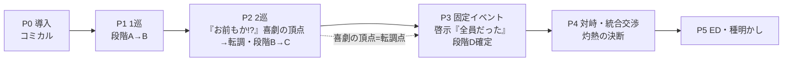

# ビートシート ─ 誰が剣を抜いたのか？

> **①全体ビートシート（体験フローの詳細版）**。
> 目的＝「このライン、そもそも面白いか」の検証＋GM進行の骨。仮の名称・仮ライン（大嘘込み）で山谷を通す。
> ②各PC差分・GM読み上げ全文・数値は後工程（キャラ確定後）。仮の箇所は「仮」と明記。
> 名称: 舞台=**王都リューゲン**／儀式=**選定の儀**（仮）／教団=**聖印教団**（仮）／聖剣=**アルルーフ**（Allruf）。

---

## 全体アーク

**設計の賭け**: 「全員が自分を犯人と思い、素知らぬ顔で探り合う」構造的茶番で掴み、段階Bの相互露見「お前もか!?」を喜劇の頂点かつ転調点にする。以降は真相へ近づくほど静かに重くなり、最後に「誰の剣にするか」の灼熱の交渉で燃え尽きる。**賭け金（罪・暗殺・剣の消失期限）は序盤から本物**。

## タイムテーブル（想定 約3.2h／幅は卓次第）

> テンション列: ▁最低 → █最高。喜劇の頂点(P2)と灼熱の決断(P4)の二峰。

| Phase | 内容 | 尺(分) | テンション | トーン | 到達段階 |
|-------|------|:---:|:---:|--------|:---:|
| P0 | 導入・HO読み・ルール | 25 | ▁▃ | コミカル | － |
| P1 | 1巡（調査15→依頼20→会議15） | 50 | ▃▅ | コミカル | A→B |
| P2 | 2巡（調査15→依頼20→会議25） | 60 | ▅█ | 転調 | B→C |
| P3 | 固定イベント（段階D開示） | 10 | ▄ | 静・啓示 | D |
| P4 | 対峙＋統合交渉＋最後のダイス | 35 | ▆█ | 灼熱 | － |
| P5 | ED分岐・エピローグ・種明かし | 15 | ▅▂ | 余韻 | － |
| — | **合計** | **195** | | | |

---

## Phase 0: 導入（25分・コミカル寄り）

### 目的
世界観と「自分が国宝を持ち出した犯人だ」という各PCの秘密を飲み込ませ、素知らぬ顔で同席する滑稽な緊張を立てる。

### 開示物
- **共通プロローグ**（GM読み上げ）: 4人は名を上げた冒険者パーティー。**選定の儀**への招待状（栄誉）。だが儀式当日の朝、聖剣アルルーフは台座から消えていた。王都は騒然、儀式は中止、「何者かが国宝を盗んだ」と。
- **各PCのHO秘匿層**: 前夜、剣の声に呼ばれて台座へ行き、抜いた。手元には見知らぬ武器（断片）。「台座を空にしたのは自分だ」と全員が思い込み、誰にも言えない。
- **公開の任務**: 王家/教団がパーティーに命じる:「お前たちは信頼できる。魔物退治を続けつつ、剣の行方を追え」——**犯人が犯人捜しを命じられる**茶番の開幕。

### 進行ステップ
1. 共通プロローグ読み上げ
2. HO配布（公開層は自己紹介で開示、秘匿層は各自黙読）
3. ルール説明: 基本ループ（調査→依頼→会議）／依頼ボードの見方／聖剣スキルの**存在のみ**告知（効果は秘匿層）
4. 公開自己紹介（表の肩書と、剣捜索の任務確認）

### GM処理・チェック
- 各PLが「自分だけが犯人だと思っている」状態を確認（他PCの秘密は知らない）。
- 聖剣スキルの秘匿運用ルールを各PLに個別確認（宣言タイミング＝依頼2日目の振り前）。

### 仮ライン（大嘘）
> GM「4人が顔を合わせた瞬間、全員が同時に、ほんの一瞬、目を逸らした。……気のせいという顔で、各々が旅の埃を払っている。」

---

## Phase 1: 1巡目 ── 調査 → 依頼 → 会議（50分・段階 A→B）

### 目的
「外部犯はありえない、犯人は儀式に招かれた内側の誰か」（段階A）を全員に飲ませ、依頼フェーズで最初の「滲み」の種を蒔く。

### 調査（単独・15分）
- 各自2枚取得。**NPC消去系が主役**:
  - 「宝物庫に破られた形跡なし」（外部侵入の否定）
  - 「儀式の間は素質なき者を弾く結界」（一般人・工作員は物理的に入れない）
  - 「隣国の工作員は儀式の夜、宝物庫の"外"で衛兵に捕まっていた」（動機はあったが不可能＝ミスリードの受け皿を先に消す）
- → 外堀が埋まり「入れたのは招かれた4人だけ」に収束。だが**全員が「犯人は自分」と知っている**から、この段階Aは各PCにとって笑えない。

### 依頼（二人一組・共同累積制・20分）
- 依頼ボード（掲示板UI）から選択。1巡目は2タッグが各1件。例:「郊外のゴブリン退治」「行商人の護衛」——魔物退治の日常。
- **判定**: タッグ2人が各自d6を1個×2回（1日目・2日目）、計4個の合計が目標値以上で成功。段階制成果（完全/部分/痕跡）。
- **時間差ジレンマの初回**: 1日目の出目を見て、2日目に聖剣スキルを切るか判断。好調なら温存（隠せる）、不調なら切る（＝相方に「今の、おかしくないか?」が滲む）。
- **成果**: 相方の断片の発現形の目撃 → 割当格子の充填開始。タッグ相方の選択＝「誰を観測するか」の最初の駆け引き。

### 会議（1巡目・15分）
- **論点**: 段階Aの共有。「外部犯じゃない…じゃあ、この中の誰が?」
- **着地**: 「犯人は招かれた4人の誰か」までは全員合意。だが誰も自分から白状しない（全員が自分だと思っているから、他人を疑う議論を必死に演じる）。**喜劇の助走**。
- **持ち帰る宿題**: 「次の調査と依頼で、互いの前夜の動きを探る」空気ができる。

### GM処理・チェック
- 割当格子の充填状況を確認（1巡目終了時点で各PCの行が1〜2マス）。
- 聖剣スキルを使ったPCがいれば、相方に「滲み」情報を秘密裏に渡す。

### 仮ライン（大嘘）
> 依頼中、狡智とのタッグでゴブリンの群れに囲まれる。狡智の斥候技がありえない精度で退路を見抜く。「……手慣れてるな」「まあ、場数だよ」——場数では説明がつかない、と勇気は思う。

---

## Phase 2: 2巡目 ── 調査 → 依頼 → 会議（60分・段階 B→C・転調点）

### 目的
**段階Bの相互露見「お前もか!?」を喜劇の頂点として爆発させ**、そこから段階C「剣は盗まれたのではなく変形した」へ静かに潜り、トーンを転調させる。

### 調査（単独・15分）
- **碑文系が主役**:
  - 「選定の資は四つ。勇なき剣は振るわれず、智なき剣は迷い、信なき剣は汚れ、狡なき剣は死ぬ」
  - 「剣は選びし者の手に、その者の得物の形を取る」（断片の形＝資質の対応が見え始める＝段階C）
- **前夜の痕跡系**: 台座周りに複数人分の足跡・遺留品。「一人じゃない」の物証。

### 依頼（二人一組・20分）
- 残るタッグ編成で最後の観測機会（全3通り中2通りしか組めない設計の締め）。聖剣スキルの滲みが出そろい、割当格子が一気に埋まる。
- **断罪者の影が初めて依頼中に差す**（尾行・不審な視線・「教団の使いが探りに来た」）。日常が脅威に傾く転調の合図。

### 会議（2巡目・山場・25分）
- **論点1（喜劇の頂点）**: 痕跡と滲みの突き合わせで「複数人が前夜あの場にいた」が露見 → **「お前もか!?」**。全員が犯人だったと発覚し、笑いと脱力。
- **論点2（転調）**: 直後、碑文の解読で「四つの武器＝四つの資質＝剣は分かれた」に接続。「盗まれたんじゃない……分かれたんだ、俺たちに」。笑いが引く。
- **着地**: 段階Cまで到達。「では、なぜ分かれた? これから剣はどうなる?」が次への問いとして残る（段階Dは固定イベントで開く）。

### GM処理・チェック
- **割当格子が8割方埋まっていることを確認**（詰み防止ライン）。未達なら会議中に碑文/痕跡の追加ヒントで補う。
- 「全員当事者」の合意が取れたことを確認してPhase3へ。

### 仮ライン（大嘘）
> 4人が同時に、懐から見知らぬ武器を取り出してしまう。大剣、杖、錫杖、短剣。沈黙。誰かが呟く。「……全員、持ってたのか」。笑いが起きかけて、碑文の一節が誰かの口をつく。「"四つ揃いて剣は完（まった）し"——待て。これ、まずいぞ」

---

## Phase 3: 固定イベント ── 段階D開示（10分・啓示・最も静か）

### 目的
運任せにせず、**全員選定の真相を確定的に開示**する。ゲームの問いを切り替える。

### 開示（碑文の最終断片・全員に同時読み上げ）
- 「四資質は一つの器に宿らず」＝分化は剣の苦渋の解。**誰も選ばれなかったのではない。全員で一人の選ばれし者だった。**
- 「満つ夜を越えれば散った光は消える」＝**時限**。次の満月（＝今夜）まで。
- 「願いを一つにすれば、剣は再び姿を取る」＝**統合の可能性**。ただし断片は物理保持、全員の同意が要る。

### 問いの切り替え
> ~~誰が剣を抜いたのか~~ → **誰の剣にするのか**

### 進行ステップ
1. 碑文最終断片の読み上げ（GM）
2. 3つの事実（全員選定／時限／統合可能）の確認
3. 各PLに秘匿層の「天秤」（統合先への利害）を再確認させ、Phase4の交渉に備えさせる

### トーン
喜劇は完全に退く。四人が「選ばれていた」ことの重みと、満つ夜までにどうするかの静かな圧。

---

## Phase 4: 終盤 ── 対峙＋統合交渉＋最後のダイス（35分・灼熱の決断）

### 目的
断罪者の包囲という外圧の下で、「統合するか・誰に」を全員一致の交渉で決めさせ、最後の判定に賭けさせる。

### ①断罪者の包囲（証明型・5分）
- 満つ夜、**聖印教団の断罪者**が包囲を完成させる:「儀式外で剣に触れた大罪人を処断する」。目の前の4人がまさにそれ。
- 突破口＝「これは窃盗ではなく**選定**だった」と証明すること。**集めた証拠（割当格子の完成度）が最終判定のボーナス**になる＝推理の成果が戦力に化ける。
- **分断の罠**（仮）: 断罪者の長「剣を返し、罪を認めよ。さすれば四人のうち一人の命は見逃そう」。

### ②統合交渉（拒否権付き全員一致・20分）
- ルール: 「一人に集めれば完全な聖剣が戻る」。だが断片は各自が物理保持＝**誰か一人でも降りれば統合は不成立**（分散ED系へ）。
- 各PCの天秤が衝突（方向性）: 勇気=振るわせろ／叡智=解明させろ／信仰=密命と己の板挟み／狡智=全員生きて終われ。
- **満つ夜の期限**が「保留」を許さない。何もしなければ消失ED。
- 交渉の燃料＝利得表（各EDで各PCの得点が変わる）＋信頼判断（誰に統合すると何が起きるか＝罠構造）。→ 具体配点は未決10。

### ③最後のダイス（10分）
- 統合先が決まれば、統合者が**フル聖剣スキル**で断罪者との対峙判定を振る。分散のままなら半端な戦力で挑む。
- 集めた証拠枚数がボーナス。成否でED細分岐。
- 「あの時、別の奴に託していれば」——**後悔の発生装置**がここで作動。

### GM処理・チェック
- 交渉が空中戦（損得の根拠なし）に陥っていないか監視。詰まれば利得の一部をGMヒントで可視化。
- 全員一致の成立/不成立を判定し、対応するED系統へ分岐。

---

## Phase 5: エンディング（15分・余韻→種明かし）

### ED分岐処理
統合先（勇気/叡智/信仰/狡智）× 最終判定の成否 × 個別採点（利得表）で分岐。詳細条件は 01_truth §4（後工程）。

| ED系統 | 条件 | 概要 |
|--------|------|------|
| 統合ED（→各資質） | 全員一致で譲渡＋対峙成功 | 完全体の聖剣は担い手に適した姿を取る。担い手はその後を背負う |
| 統合・惨敗 | 全員一致だが対峙失敗 | 剣は戻ったが断罪者に及ばず。担い手の犠牲等（要設計） |
| 分散ED | 交渉不成立・各自保持のまま対峙 | 剣は分かたれたまま。決着は半端な戦力で |
| 消失ED | 満つ夜を越える | 断片は只の武器に堕ち、選定は永遠に失われる。全員、ただの窃盗犯として |

### 進行ステップ
1. 該当EDのエピローグ読み上げ
2. 個別採点の集計（利得表・全ED共通）と勝敗announce
3. **種明かし**: GMが真相編（前夜の全体像・剣の意思・断罪者の背景）を開示。「全員が選ばれていた」の全景を共有して余韻に

---

## 面白さ検証のための自己点検（設計者向けメモ）

| 論点 | 現状の見立て | 要検証 |
|------|-------------|--------|
| 掴み | 「犯人が犯人捜し」の茶番＋コミカルは強い | P0-1が説明過多で中だるみしないか（尺25+50に収まるか） |
| 中盤の山 | 「お前もか!?」の相互露見は明確なピーク | 段階Bが早く割れすぎると喜劇が萎む → 立証速度の均し（03参照） |
| 転調 | 喜劇→啓示の落差が本作の核 | 転調が急すぎ/緩すぎないか。P2会議→P3の10分接続で足りるか |
| 終盤 | 統合交渉＋期限＋断罪者の三重圧は濃い | 35分に収まるか。交渉が空中戦にならないか（利得表の実体が要る） |
| 依頼 | 時間差ジレンマは体験の目玉 | 「切るか温存か」で悩ましい数値になるか（テスト必須） |
| 全体尺 | 195分＝約3.2h | P2が60分と最重。ここが伸びると4h越えのリスク |
